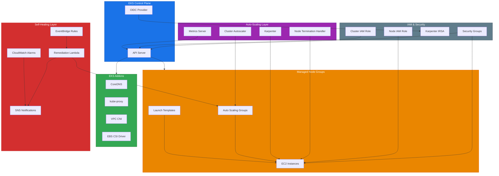

# terraform-aws-auto-healing-eks

Self-healing Amazon EKS cluster with automated node remediation, pod disruption budgets, cluster autoscaler, and Karpenter integration. This module provisions a production-ready Kubernetes cluster on AWS with comprehensive health monitoring and automatic recovery from node failures.

## Architecture



## Documentation

- [Amazon EKS User Guide](https://docs.aws.amazon.com/eks/latest/userguide/what-is-eks.html)
- [Karpenter Getting Started](https://karpenter.sh/docs/getting-started/)
- [EKS Node Health](https://docs.aws.amazon.com/eks/latest/userguide/node-health.html)
- [Terraform aws_eks_cluster Resource](https://registry.terraform.io/providers/hashicorp/aws/latest/docs/resources/eks_cluster)
- [EKS Best Practices Guide](https://aws.github.io/aws-eks-best-practices/)
- [Cluster Autoscaler on AWS](https://github.com/kubernetes/autoscaler/blob/master/cluster-autoscaler/cloudprovider/aws/README.md)

## Prerequisites

- Terraform >= 1.5.0
- AWS Provider >= 5.40.0
- Helm Provider >= 2.12.0
- An existing VPC with at least 2 subnets in different Availability Zones
- AWS CLI configured with appropriate credentials
- `kubectl` installed for post-deployment cluster access
- Sufficient IAM permissions to create EKS clusters, IAM roles, Lambda functions, and related resources

## Deployment Guide

### Step 1: Configure Backend (Optional)

Create a `backend.tf` for remote state storage:

```hcl
terraform {
  backend "s3" {
    bucket         = "my-terraform-state"
    key            = "eks/terraform.tfstate"
    region         = "us-east-1"
    dynamodb_table = "terraform-locks"
    encrypt        = true
  }
}
```

### Step 2: Create Variable Definitions

Create a `terraform.tfvars` file:

```hcl
cluster_name    = "production-eks"
cluster_version = "1.29"
vpc_id          = "vpc-0123456789abcdef0"
subnet_ids      = ["subnet-aaa", "subnet-bbb", "subnet-ccc"]

node_groups = [
  {
    name           = "general"
    instance_types = ["m5.xlarge"]
    min_size       = 3
    max_size       = 15
    desired_size   = 5
    disk_size      = 100
  },
  {
    name           = "compute"
    instance_types = ["c5.2xlarge"]
    min_size       = 0
    max_size       = 10
    desired_size   = 2
    capacity_type  = "SPOT"
    labels         = { workload = "compute" }
  }
]

enable_karpenter                = true
enable_cluster_autoscaler       = false
enable_node_termination_handler = true
enable_auto_remediation         = true

tags = {
  Environment = "production"
  Team        = "platform"
  ManagedBy   = "terraform"
}
```

### Step 3: Initialize and Apply

```bash
terraform init
terraform plan -out=tfplan
terraform apply tfplan
```

### Step 4: Configure kubectl

```bash
aws eks update-kubeconfig --name production-eks --region us-east-1
kubectl get nodes
```

### Step 5: Verify Components

```bash
# Check Karpenter
kubectl get pods -n karpenter

# Check metrics server
kubectl top nodes

# Check node termination handler
kubectl get daemonset -n kube-system aws-node-termination-handler
```

## Inputs

| Name | Description | Type | Default | Required |
|------|-------------|------|---------|----------|
| `cluster_name` | Name of the EKS cluster | `string` | n/a | yes |
| `cluster_version` | Kubernetes version for the EKS cluster | `string` | `"1.29"` | no |
| `vpc_id` | VPC ID where the EKS cluster will be deployed | `string` | n/a | yes |
| `subnet_ids` | List of subnet IDs (minimum 2 in different AZs) | `list(string)` | n/a | yes |
| `node_groups` | List of managed node group configurations | `list(object)` | See variables.tf | no |
| `enable_karpenter` | Enable Karpenter for node auto-provisioning | `bool` | `true` | no |
| `enable_cluster_autoscaler` | Enable Kubernetes Cluster Autoscaler | `bool` | `false` | no |
| `enable_node_termination_handler` | Enable AWS Node Termination Handler | `bool` | `true` | no |
| `enable_auto_remediation` | Enable automated node remediation via Lambda | `bool` | `true` | no |
| `remediation_lambda_timeout` | Timeout in seconds for remediation Lambda | `number` | `300` | no |
| `alarm_evaluation_periods` | Number of evaluation periods for health alarms | `number` | `3` | no |
| `alarm_threshold` | Threshold for CloudWatch node health alarms | `number` | `1` | no |
| `tags` | Tags to apply to all resources | `map(string)` | `{}` | no |

## Outputs

| Name | Description |
|------|-------------|
| `cluster_id` | The ID of the EKS cluster |
| `cluster_arn` | The ARN of the EKS cluster |
| `cluster_endpoint` | The endpoint URL for the EKS cluster API server |
| `cluster_certificate_authority` | Base64 encoded certificate data for cluster communication |
| `node_group_ids` | Map of node group names to their IDs |
| `karpenter_role_arn` | ARN of the IAM role used by Karpenter |
| `remediation_lambda_arn` | ARN of the node remediation Lambda function |
| `oidc_provider_arn` | ARN of the OIDC provider for the EKS cluster |

## Usage Example

```hcl
module "eks_self_healing" {
  source = "github.com/kogunlowo123/terraform-aws-auto-healing-eks"

  cluster_name    = "my-cluster"
  cluster_version = "1.29"
  vpc_id          = module.vpc.vpc_id
  subnet_ids      = module.vpc.private_subnets

  node_groups = [
    {
      name           = "application"
      instance_types = ["m5.large", "m5a.large"]
      min_size       = 2
      max_size       = 20
      desired_size   = 4
    }
  ]

  enable_karpenter                = true
  enable_cluster_autoscaler       = false
  enable_node_termination_handler = true
  enable_auto_remediation         = true

  alarm_evaluation_periods   = 3
  alarm_threshold            = 1
  remediation_lambda_timeout = 300

  tags = {
    Environment = "production"
    Project     = "platform"
  }
}

output "kubeconfig_command" {
  value = "aws eks update-kubeconfig --name ${module.eks_self_healing.cluster_id}"
}
```

## License

MIT License - see [LICENSE](LICENSE) for details.
